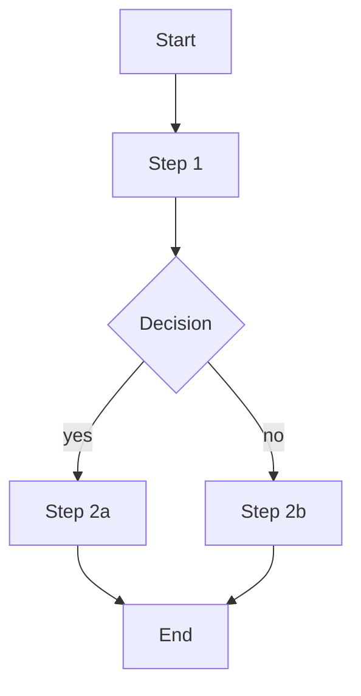

<!--
═══════════════════════════════════════════════════════════════════════════════
  READ-ONLY · DO NOT EDIT THIS FILE
═══════════════════════════════════════════════════════════════════════════════
  ไฟล์ใน `standards/templates/` เป็น snapshot ของ BDA AI Dev Standard org repo
  จะถูก **overwrite ทั้ง folder** เมื่อรัน `/bda-sync`
  ────────────────────────────────────────────────────────────────────────────
  ต้องการแก้?
    • Project-wide (commit + share team) → คัดลอกไฟล์นี้ไป `templates/<name>.md`
      → แก้ที่นั่น → commit  (lookup priority สูงกว่า standards/)
    • Personal-only (ไม่ commit)         → คัดลอกไป `.bda-spec/local/templates/<name>.md`
      → แก้ที่นั่น (gitignored)         (lookup priority สูงสุด)
  ════════════════════════════════════════════════════════════════════════════
-->

---
tags: [type/flow]
status: draft
date: <YYYY-MM-DD>
related_features: []
related_functions: []
---

# Flow — <Flow name>

## 1. Purpose
<what user achieves through this flow>

## 2. Actors
- Primary: <persona>
- Secondary: <if any>

## 3. Pre-conditions
- <state required>

## 4. Steps

1. <step 1 description — links to [[FN-...]]>
2. <step 2>
3. ...

## 5. Post-conditions / Success
- <state after success>

## 6. Error paths
- <error 1> → <recovery>

## 7. Variations
- <variation by role / context>
