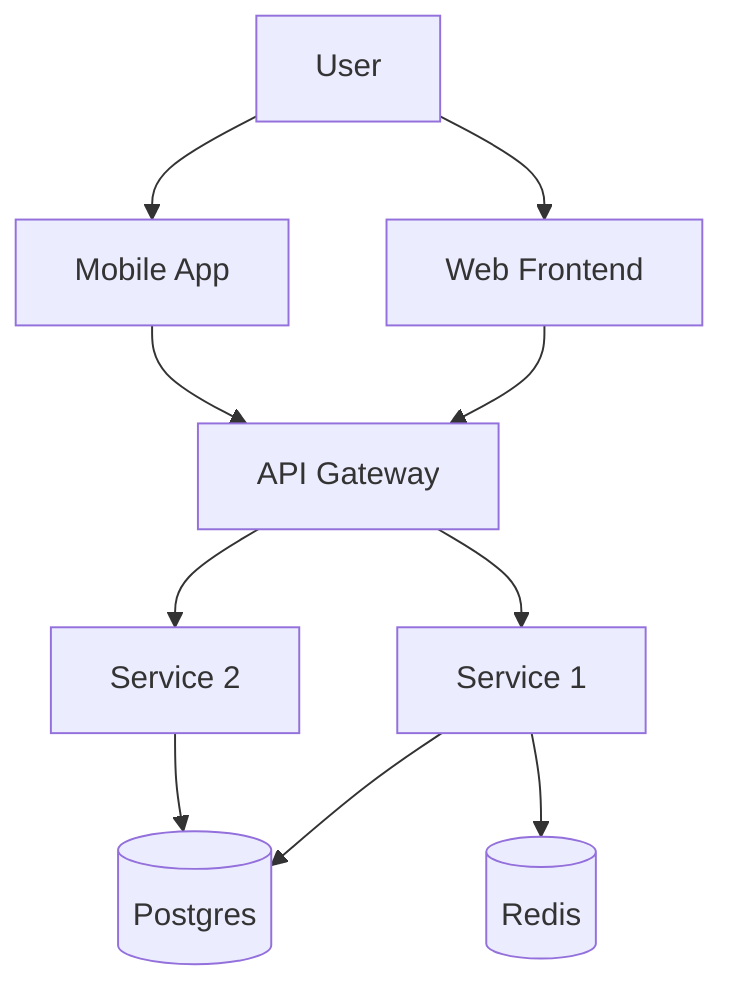

<!--
═══════════════════════════════════════════════════════════════════════════════
  READ-ONLY · DO NOT EDIT THIS FILE
═══════════════════════════════════════════════════════════════════════════════
  ไฟล์ใน `standards/templates/` เป็น snapshot ของ BDA AI Dev Standard org repo
  จะถูก **overwrite ทั้ง folder** เมื่อรัน `/bda-sync`
  ────────────────────────────────────────────────────────────────────────────
  ต้องการแก้?
    • Project-wide (commit + share team) → คัดลอกไฟล์นี้ไป `templates/<name>.md`
      → แก้ที่นั่น → commit  (lookup priority สูงกว่า standards/)
    • Personal-only (ไม่ commit)         → คัดลอกไป `.bda-spec/local/templates/<name>.md`
      → แก้ที่นั่น (gitignored)         (lookup priority สูงสุด)
  ════════════════════════════════════════════════════════════════════════════
-->

---
tags: [type/tech-spec]
status: draft
version: 0.1.0
date: <YYYY-MM-DD>
prd: [[PRD-<slug>]]
srs: [[SRS-<slug>]]
---

# Tech Spec — <Product / Feature>

## 1. Tech stack

| Layer | Choice | Why |
|---|---|---|
| Frontend | <e.g. React + Tailwind> | <reason> |
| Backend | <e.g. .NET 8 Web API> | <reason> |
| Mobile | <e.g. Flutter> | <reason> |
| Database | <e.g. PostgreSQL> | <reason> |
| Cache | <e.g. Redis> | <reason> |
| Message bus | <e.g. RabbitMQ> | <reason> |
| Auth | <e.g. JWT + RBAC> | <reason> |
| Hosting | <e.g. Azure App Service> | <reason> |

## 2. Architecture

## 3. Data model

### Entity: <name>
| Field | Type | Constraints | Note |
|---|---|---|---|
| id | uuid | PK | |
| ... | ... | ... | |

Relationships:
- <entity A> 1—N <entity B>

## 4. API contracts (high-level)

### POST /<resource>
- Auth: <required role>
- Request: <schema>
- Response: <schema>
- Errors: <list>

(detailed contracts ใน [[REF-APIIntegration]])

## 5. Auth & RBAC
- AuthN: <method>
- AuthZ: <RBAC model>
- Roles: <list — see [[REF-AuthorizationMatrix]]>

## 6. Deployment
- Environments: dev / staging / production
- CI/CD: <pipeline>
- Migration strategy: <approach>
- Rollback strategy: <approach>

## 7. Observability
- Logging: <stack, format>
- Metrics: <stack>
- Tracing: <stack>
- Alerting: <channels>

## 8. Security
- Encryption at rest: 

- Encryption in transit: 

- Secret management: 

- Audit log: <approach>

## 9. Decisions (ADR refs)
- [[ADR-0001-choosing-postgres]]
- [[ADR-0002-auth-jwt-vs-session]]
