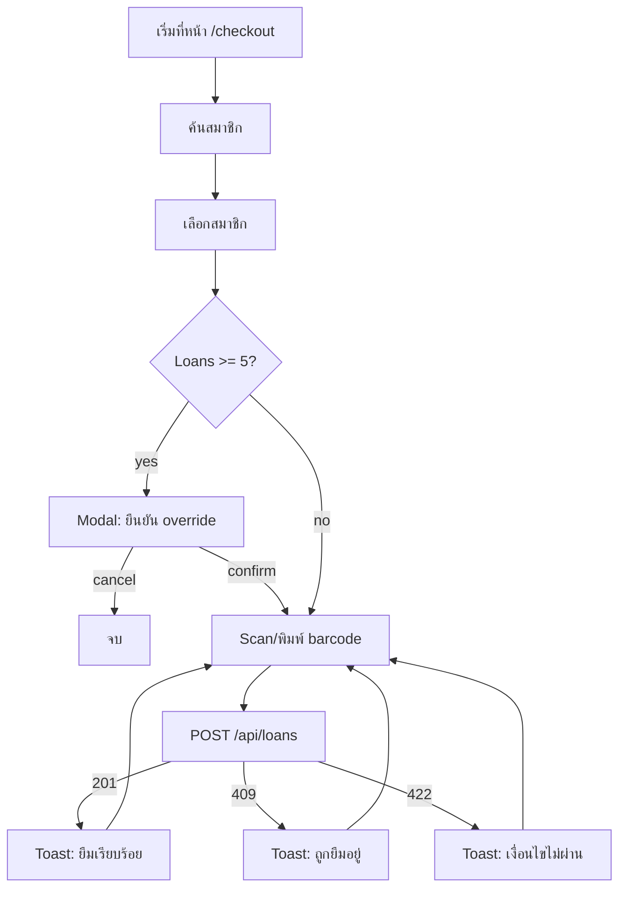

# Flow — Book Checkout

## 1. Purpose
Librarian ยืมหนังสือให้สมาชิก

## 2. Actors
- Primary: Librarian
- Affected: Member (เห็น loan ใหม่ใน portal หลังจาก)

## 3. Pre-conditions
- Librarian authenticated
- Member active + < 5 loans (else override)
- Book status: available

## 4. Steps

## 5. Post-conditions / Success
- Loan record created
- Book.status = on_loan
- Member.active_loans_count + 1
- Audit log written

## 6. Error paths
- Book lost → cannot checkout, suggest report
- Member inactive → cannot checkout, suggest reactivate flow
- Concurrent checkout → 409, librarian retry with another book

## 7. Variations
- Override flow (member > 5 loans): require explicit confirm
