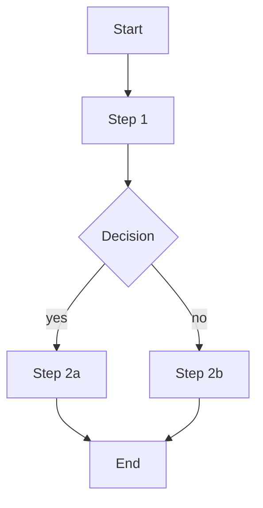

# Flow — <Flow name>

## 1. Purpose
<what user achieves through this flow>

## 2. Actors
- Primary: <persona>
- Secondary: <if any>

## 3. Pre-conditions
- <state required>

## 4. Steps

1. <step 1 description — links to [[FN-...]]>
2. <step 2>
3. ...

## 5. Post-conditions / Success
- <state after success>

## 6. Error paths
- <error 1> → <recovery>

## 7. Variations
- <variation by role / context>
